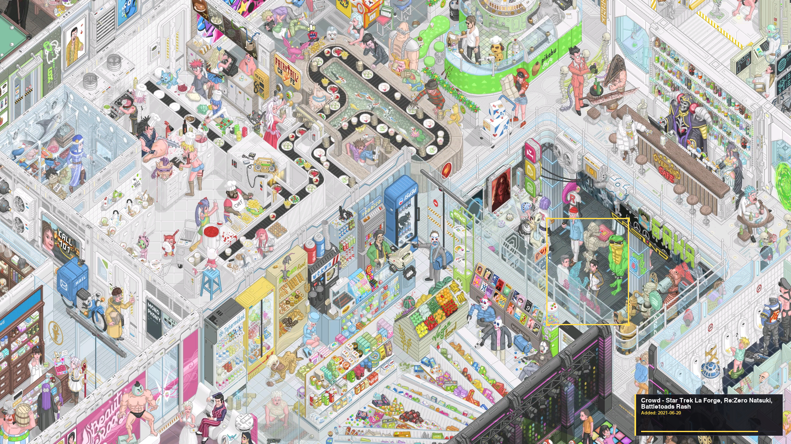
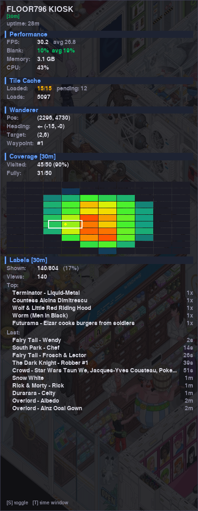

# Floor796 Kiosk

A self-contained animated pixel-art kiosk that displays the
[floor796.com](https://floor796.com) interactive isometric map on a dedicated
display — designed for Raspberry Pi 5 (4 GB+).

The player boots from cold-start, automatically pans across the full animated
scene ensuring every tile is visited, and keeps the display on 24/7 with no
screensaver or sleep.  As objects scroll into view, the highlighter identifies
them from floor796.com's changelog, drawing a bounding box and info panel with
title, date, and thumbnail (YouTube, image, video, or Wikipedia).  When the
floor796 author publishes new tiles, they are automatically downloaded and
incorporated on the next boot.



---

## Features

- **Full-resolution pixel art** — 1024×820 tiles rendered at native resolution
  (no scaling artifacts).
- **Coverage-weighted wandering** — a visit heat map ensures all 50+ animated
  tiles are toured evenly; a blank-ratio guard keeps the viewport on content.
- **Object highlighter** — automatically identifies and labels 804 objects from
  floor796.com's changelog as they scroll into view.  Each highlight shows a
  bounding box with pulse animation, plus an info panel with title, date, and
  thumbnail (YouTube, images, video frames, Wikipedia extracts).  Selection uses
  weighted random sampling with recency rotation so objects cycle evenly.
- **Telemetry & stats** — in-process HTTP API on `127.0.0.1:8796` provides live
  metrics: FPS, memory, CPU, tile cache, coverage heatmaps, per-object highlight
  stats, and more.  An on-screen overlay (toggled with `S`) shows real-time
  performance, coverage, and label statistics.

  

- **Auto-updating tiles** — checks floor796.com for new tiles at startup; falls
  back to cached tiles if offline.
- **Cold-boot kiosk** — boots directly into the player via systemd; no desktop
  environment needed.
- **No display sleep** — DPMS, screensaver, and power management are disabled
  at every layer.
- **No log files** — all output goes to the systemd journal (rotated
  automatically); no unbounded files are created.
- **Background tile loading** — tile decode and surface conversion happen in a
  background thread so the render loop stays smooth.

---

## Requirements

| Component          | Specification                          |
|--------------------|----------------------------------------|
| Hardware           | Raspberry Pi 5 (4 GB minimum)          |
| OS                 | Raspberry Pi OS (Bookworm or Trixie)   |
| Display            | HDMI (1920×1080 or 1920×1200)          |
| Network            | Internet for initial download + updates|
| Storage            | 4 GB free (tiles + decoded strips)    |

---

## Quick Start (Fresh Pi 5)

```bash
# 1. Clone or copy this repo to the Pi
git clone <repo-url> /tmp/floor796-kiosk
cd /tmp/floor796-kiosk

# 2. Run the installer (requires root)
sudo bash install.sh

# 3. Reboot to test cold-boot auto-start
sudo reboot
```

The first boot downloads ~123 MB of tiles and decodes them to frame strips
(~3 minutes).  Subsequent boots take ~20 seconds.

---

## File Structure

```
floor796-kiosk/
├── kiosk_player.py              # Main player (rendering + wandering)
├── tile_manager.py              # Tile download + auto-update logic
├── object_highlighter.py        # Object highlighter (804 objects, selection)
├── thumbnail_cache.py           # Thumbnail fetcher (YouTube, images, video, wiki)
├── stats_collector.py           # Telemetry collector (ring buffers, heatmaps)
├── stats_http.py                # HTTP API server (127.0.0.1:8796)
├── stats_overlay.py             # On-screen alpha-blended stats overlay
├── hologram.py                  # Hologram scene overlay
├── build_content_mask.py        # Offline content density mask generator
├── run.sh                       # Boot wrapper (starts bare X server)
├── install.sh                   # One-shot installer for fresh Raspbian
├── floor796-kiosk.service       # systemd unit (cold-boot auto-start)
├── tiles/                       # Downloaded MP4 tiles (gitignored)
├── strips/                      # Decoded frame strips (gitignored)
├── tiles_meta.json              # Grid metadata (auto-generated)
├── changelog.json               # Object metadata from floor796.com
├── content_mask.npz             # Pixel-level content density mask
├── screenshot.png               # Main screenshot (highlighter)
├── stats_overlay_screenshot.png # Stats overlay screenshot
├── README.md                    # This file
└── .gitignore
```

---

## How It Works

### Tile System

Floor796's map is a grid of 1024×820 pixel tiles.  Most tiles are static
(single-frame), but ~50 tiles in the center are animated (60-frame loops at
12 fps).  The player downloads these as MP4s from the CDN, decodes them to
full-resolution PNG frame strips using ffmpeg, and caches them in `strips/`.

Tiles are spaced at 1016×812 intervals (8 px overlap per axis), matching the
floor796.com front-end.  This overlap is critical for pixel-perfect alignment.

### Wandering Algorithm

The `Wanderer` class implements coverage-weighted waypoint navigation:

1. **Visit heat map** — counts how many frames each animated tile has been
   visible in the viewport.
2. **Waypoint scoring** — least-visited tiles get the lowest score (highest
   priority); anti-oscillation penalties prevent ping-ponging between adjacent
   tiles.
3. **Blank-ratio guard** — positions where the viewport would be more than 25%
   static content get a large penalty, keeping the camera on animated areas.
4. **Smooth steering** — gradual angle interpolation toward the next waypoint
   with momentum blending for natural-looking movement.
5. **Dynamic timeout** — far tiles get longer timeouts based on distance and
   speed (`distance / speed * 1.8`), ensuring the full scene is reachable.

Full coverage of all animated tiles is typically achieved in ~25 minutes.

### Auto-Update

At startup, `tile_manager.py` fetches `matrix.json` from floor796.com to check
for new or changed tiles.  If the network is unavailable, it silently falls
back to the existing cache — the kiosk always boots, online or offline.

### Object Highlighter

The `ObjectHighlighter` class automatically identifies and labels objects from
floor796.com's changelog (804 objects) as the wanderer brings them into view.

**Selection algorithm** — for each highlight cycle, all objects in the viewport
are scored on five factors:

| Factor | Description |
|--------|-------------|
| Spatial proximity | Objects near viewport center score higher |
| Edge safety | Objects near screen edges get up to 50% penalty (soft) |
| Panel exclusion | Objects under the info panel footprint get penalized |
| Velocity prediction | Objects that would scroll off-screen during the highlight are skipped; objects ahead of the wander direction get a bonus |
| Recency | Recently-viewed objects get exponentially decaying penalty (10-min half-life); never-viewed objects get 15% bonus |

Instead of always picking the top-scoring object (pure argmax), candidates are
sampled with probability proportional to `score³` (weighted random sampling).
This prevents the same first/second/third object on every boot while still
strongly preferring well-positioned candidates.

**Thumbnail types** — the highlighter fetches and displays:

| Link type | Thumbnail source |
|-----------|-----------------|
| YouTube | `mqdefault.jpg` from `img.youtube.com` |
| Image | Direct download (imgur, etc.) |
| Video | Frame extraction via `ffmpeg` at ~1s timestamp |
| Wikipedia | REST API (`/api/rest_v1/page/summary/`) returns thumbnail + text extract |
| Web / other | No thumbnail; compact text-only panel |

### Telemetry & Stats API

The player runs a lightweight HTTP server on `127.0.0.1:8796` (stdlib only,
no external dependencies).  All endpoints return JSON unless noted.

| Endpoint | Description |
|----------|-------------|
| `GET /stats[?window=30m]` | Full telemetry snapshot (FPS, memory, CPU, coverage, wanderer position, highlighter state, label stats) |
| `GET /health` | 24-hour health trends (RSS, CPU, FPS with min/max/avg) |
| `GET /heatmap[?window=1h]` | Viewport visit heatmap as a PNG image |
| `GET /coverage[?window=30m]` | Tile coverage grid with per-tile visit counts |
| `GET /objects` | Per-object highlight stats (id, title, views, last shown) for all 804 objects |
| `GET /objects/recent?n=20` | N most recently highlighted objects |
| `GET /objects/summary?window=30m&limit=10` | Windowed summary: most-viewed, most-recent, coverage % |
| `POST /overlay` | Toggle on-screen overlay: `{"enabled": true}` |
| `POST /overlay/window` | Set overlay time window: `{"window": "1h"}` or `{"cycle": true}` |

**On-screen overlay** — press `S` to toggle a semi-transparent stats panel
showing live FPS, memory, CPU, tile cache status, wanderer position/heading,
coverage heatmap grid, and label statistics (Top 5 most-viewed, Last 10
most-recent).  Press `T` to cycle time windows (10min → 30min → 1h → 4h →
8h → all-time).

---

## Configuration

The player can be configured via command-line arguments (see `run.sh`) or by
editing constants at the top of `kiosk_player.py`:

| Setting             | Default | Description                              |
|---------------------|---------|------------------------------------------|
| `DEFAULT_WIDTH`     | 0       | Display width (0 = auto-detect)          |
| `DEFAULT_HEIGHT`    | 0       | Display height (0 = auto-detect)         |
| `SCALE`             | 1.0     | Tile scale (must be 1.0 — see warnings) |
| `DEFAULT_WANDER_SPEED` | 15.0 | Pan speed in pixels/sec                  |
| `CACHE_MARGIN`      | 2       | Extra tile ring to prefetch              |
| `COVERAGE_LOG_INTERVAL` | 300 | Seconds between coverage log lines     |

### Display Resolution

The player **auto-detects** the native resolution of the connected display via
pygame's `display.Info()`. No configuration is needed — the code defaults to
`0` (auto-detect), and the launch script passes `--width 0 --height 0` to
enable this.

If auto-detection fails (e.g., no display connected at boot), it falls back to
1920×1080.

To override with a specific resolution, set the `KIOSK_WIDTH` and
`KIOSK_HEIGHT` environment variables, or pass `--width` and `--height` directly:

```bash
# Override to 1920×1200 via environment
KIOSK_WIDTH=1920 KIOSK_HEIGHT=1200
```

---

## Service Management

```bash
# Start / stop / restart
sudo systemctl start floor796-kiosk
sudo systemctl stop floor796-kiosk
sudo systemctl restart floor796-kiosk

# View live logs
journalctl -u floor796-kiosk -f

# Check status
sudo systemctl status floor796-kiosk

# Disable auto-start
sudo systemctl disable floor796-kiosk
```

---

## Manual Controls (for testing)

When a keyboard/mouse is connected during maintenance:

| Key             | Action                     |
|-----------------|----------------------------|
| Space           | Toggle auto-wandering      |
| Arrow keys      | Pan manually               |
| Mouse drag      | Pan manually               |
| V               | Print coverage stats       |
| O               | Toggle object highlighter  |
| L               | Switch label mode (corner/inline) |
| S               | Toggle stats overlay       |
| T               | Cycle stats time window    |
| ESC             | Quit (service will restart)|
| F               | Toggle fullscreen          |

---

## Troubleshooting

### Black screen on boot

- Check HDMI cable and that the display is powered on.
- Check logs: `journalctl -u floor796-kiosk -b`
- Ensure `hdmi_force_hotplug=1` is set in `/boot/firmware/config.txt`.
- Try a different `hdmi_group` / `hdmi_mode` in config.txt.

### Player crashes / restarts repeatedly

- Check logs: `journalctl -u floor796-kiosk --no-pager -n 100`
- Ensure the venv has pygame installed: `ls /opt/floor796-kiosk/venv/bin/python`
- Check available memory: `free -h` (needs ~2 GB free).
- Ensure tiles are downloaded: `ls /opt/floor796-kiosk/tiles/*.mp4 | wc -l`

### Display goes to sleep

- The installer disables DPMS at the X server level (`-dpms`, `-s 0`).
- Also check `/boot/firmware/config.txt` for `hdmi_blanking=1`.
- Some displays have their own sleep timer — check the monitor's OSD menu.

### Tiles not updating

- The player checks for updates at every startup.  If offline, it uses cache.
- To force a manual update: `sudo -u kiosk /opt/floor796-kiosk/venv/bin/python /opt/floor796-kiosk/tile_manager.py`

---

## Performance

| Metric              | Value (Pi 5, 4 GB)              |
|---------------------|---------------------------------|
| Render rate         | 30 fps (vsync)                 |
| Animation rate      | 12 fps (60-frame, 5s loop)     |
| Memory (RSS)        | ~2.7 GB                        |
| Swap                | 0 MB                           |
| CPU                 | ~50% (one core)                |
| Cold-boot to display| ~20s (warm), ~3 min (first run)|
| Full coverage       | ~25 minutes                    |
| Objects highlighted | 804 (100% reachable)           |

---

## Credits

- [Floor796](https://floor796.com) — the original interactive isometric
  pixel-art map of the 796th floor.  All tile artwork belongs to the floor796
  project.
- This kiosk is a standalone viewer; it does not modify or redistribute the
  original artwork beyond caching tiles for local display.

## License

The code in this repository is provided as-is for personal use.  The floor796
tile artwork remains the property of its respective creators.
