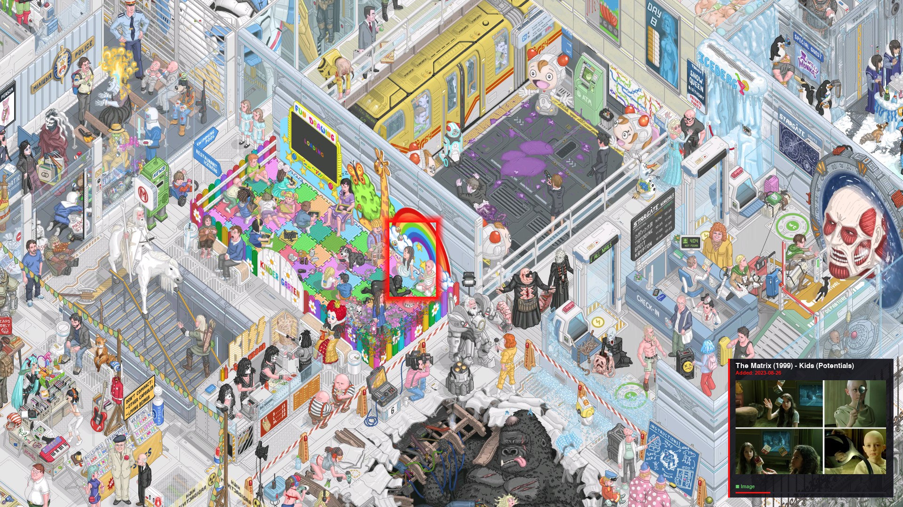
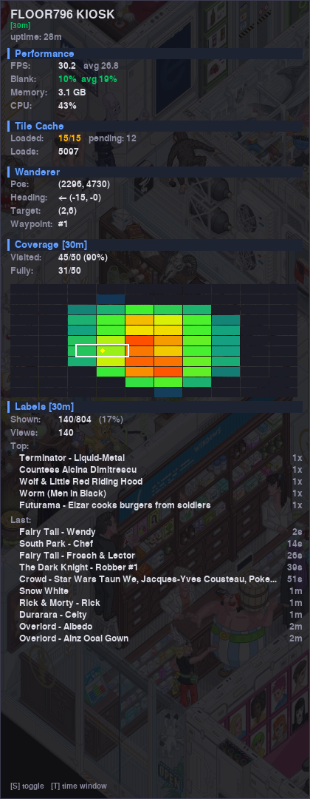

# Floor796 Kiosk

A self-contained animated pixel-art kiosk that displays the
[floor796.com](https://floor796.com) interactive isometric map on a dedicated
display — designed for Raspberry Pi 5 and OrangePi 5 Max.

The player boots from cold-start, automatically pans across the full animated
scene ensuring every tile is visited, and keeps the display on 24/7 with no
screensaver or sleep.  As objects scroll into view, the highlighter identifies
them from floor796.com's changelog, drawing a bounding box with a zoom-in
animation, breathing glow, and info panel with title, date, and thumbnail
(YouTube, image, video, Wikipedia, or interactive).  When the floor796 author
publishes new tiles, they are automatically downloaded and incorporated on the
next boot.



---

## Features

- **Full-resolution pixel art** — 1024×820 tiles rendered at native resolution
  (no scaling artifacts).
- **KMSDRM unified rendering** — both Raspberry Pi 5 (V3D) and OrangePi 5 Max
  (Panthor) render directly through KMSDRM with no X11 overhead.  Boards ≤4 GB
  RAM are capped at 1080p to prevent OOM; higher memory boards render at native
  resolution (up to 4K).  The highlighter UI scales proportionally with display
  height (2.0× at 4K, 1.33× at 1440p, 1.0× at 1080p) for crisp text and panels
  at any resolution.
- **Coverage-weighted wandering** — a visit heat map ensures all 50+ animated
  tiles are toured evenly.  Content-aware scroll limits (derived from the
  pixel-level density mask) keep the viewport hugging actual pixel-art content,
  not blank tile-grid borders.  A* pathfinding through a safe-region grid
  ensures transit stays on content.
- **Object highlighter** — automatically identifies and labels 804 objects from
  floor796.com's changelog as they scroll into view.  Each highlight features a
  zoom-in intro animation (viewport bounds contract to the object over 0.5s),
  followed by a breathing glow effect.  Deterministic LRU selection ensures
  every object is shown before any repeats, with scroll-off safety checks.
- **Overscan support** — `KIOSK_OVERSCAN_MARGIN` environment variable insets all
  content and UI for displays with overscan (configured in the systemd unit).
- **Telemetry & stats** — in-process HTTP API on `127.0.0.1:8796` provides live
  metrics: FPS, memory, CPU, tile cache, coverage heatmaps, per-object highlight
  stats, and more.  An on-screen overlay (toggled with `S`) shows real-time
  performance, coverage, and label statistics.

  

- **Auto-updating tiles** — checks floor796.com for new tiles at startup; falls
  back to cached tiles if offline.
- **Cold-boot kiosk** — boots directly into the player via systemd; no desktop
  environment needed.
- **No display sleep** — DPMS, screensaver, and power management are disabled
  at every layer.
- **No log files** — all output goes to the systemd journal (rotated
  automatically); no unbounded files are created.
- **Background tile loading** — tile decode and surface conversion happen in a
  background thread so the render loop stays smooth.

---

## Requirements

| Component          | Specification                                    |
|--------------------|--------------------------------------------------|
| Hardware           | Raspberry Pi 5 (2 GB min, 4 GB+ recommended) or  |
|                    | OrangePi 5 Max (8 GB)                            |
| OS                 | Raspberry Pi OS / Armbian (Bookworm or Trixie)   |
| Display            | HDMI (1920×1080 native, or higher with 4 GB+)    |
| Network            | Internet for initial download + updates          |
| Storage            | 4 GB free (tiles + decoded strips)               |

> **2 GB boards** (e.g. Raspberry Pi 5 2 GB) are supported with a reduced tile
> cache (8 tiles vs 18) and a low-memory warning banner.  The player uses ~1.5 GB
> RSS and relies on swap under heavy load.  4 GB+ is recommended for headroom.

---

## Quick Start (Fresh Pi 5)

```bash
# 1. Clone or copy this repo to the Pi
git clone <repo-url> /tmp/floor796-kiosk
cd /tmp/floor796-kiosk

# 2. Run the installer (requires root)
sudo bash deploy/install.sh

# 3. Reboot to test cold-boot auto-start
sudo reboot
```

The installer copies the code and configures the system service — it does
**not** download any content.  Tiles, labels, and all other assets are
fetched automatically on the first boot of the player:

- ~123 MB of tiles from floor796.com
- Object labels (changelog.json)
- Decoded frame strips (~8 minutes)
- Content density mask (~2 minutes)

All of this is cached — subsequent boots take ~20 seconds.

---

## Project Structure

```
floor796-kiosk/
├── floor796_kiosk/               Python package
│   ├── __init__.py
│   ├── __main__.py               Entry point: python -m floor796_kiosk
│   ├── paths.py                  Centralized path management
│   ├── board_detect.py           Board detection (Pi 5 / OrangePi / generic)
│   ├── player.py                 Main player (rendering + wandering)
│   ├── tile_manager.py           Tile download + auto-update logic
│   ├── content_mask.py           Content density mask generator
│   ├── hologram.py               Hologram scene overlay
│   ├── highlighter.py            Object highlighter (804 objects, LRU selection)
│   ├── thumbnails.py             Thumbnail fetcher (YouTube, images, video, wiki, tenor, fandom, web)
│   ├── cpu_affinity.py           big.LITTLE CPU core pinning
│   └── stats/
│       ├── __init__.py
│       ├── collector.py          Telemetry collector (ring buffers, heatmaps)
│       ├── http_server.py        HTTP API server (127.0.0.1:8796)
│       └── overlay.py            On-screen alpha-blended stats overlay
├── assets/                       Downloaded from floor796.com (cached, gitignored)
│   ├── tiles/                    Source tile MP4s
│   ├── tiles_meta.json           Grid metadata
│   ├── tile_state.json           Per-tile download fingerprints (update detection)
│   ├── changelog.json            Object labels / polygon data
│   └── holograms/                Hologram scene sources
├── cache/                        Generated at runtime (rebuildable, gitignored)
│   ├── strips/                   Decoded frame strips (BMP)
│   ├── content_mask.npz          Pixel-level content density mask
│   └── thumbnails/               Resized label thumbnails
├── tools/                        Utilities, tests & simulations
│   ├── kiosk_status.py           [Operator] Query the stats API from CLI
│   ├── prefetch_thumbnails.py    [Operator] Pre-fetch all thumbnails offline (all link types)
│   ├── test_tile_update.py       [Test] Tile update engine regression suite (local fake server)
│   ├── test_hologram_fixes.py    [Test] Hologram/highlighter regression suite (headless)
│   ├── sim_wander.py             [Maintained] Wanderer coverage simulation
│   ├── sim_heatmap.py            [Maintained] Wanderer heatmap simulation + visualization
│   ├── sim_prefetch_v3.py        [Maintained] Tile prefetch/cache eviction simulation
│   ├── sim_prefetch.py           [Legacy] First prefetch sim; wrong eviction model — see v3
│   └── simulate_wander.py        [Legacy] Pre-refactor wanderer sim; superseded by sim_wander/sim_heatmap
├── deploy/                       Installation & systemd
│   ├── install.sh                One-shot installer for fresh Pi/OrangePi
│   ├── run.sh                    Boot wrapper (KMSDRM or X11 fallback)
│   ├── kiosk-launch.sh           Player launcher (env setup, overscan margin)
│   └── floor796-kiosk.service    systemd unit (cold-boot auto-start)
├── screenshot.png                Main screenshot (highlighter)
├── stats_overlay_screenshot.png  Stats overlay screenshot
├── README.md
├── CHANGELOG.md
└── .gitignore
```

### Directory Roles

- **`assets/`** — files downloaded from floor796.com and cached locally.  If
  deleted, the player re-downloads them on next boot.  Safe to delete to force
  a fresh download.
- **`cache/`** — files generated by the player at runtime (decoded strips,
  content mask, thumbnails).  Safe to delete at any time; the player rebuilds
  them automatically (strips take ~8 min, content mask ~2 min).
- **`floor796_kiosk/`** — the Python package.  Entry point is
  `python -m floor796_kiosk`.
- **`tools/`** — offline simulation scripts and CLI utilities, not needed for
  normal operation.
- **`deploy/`** — system integration scripts, used only during installation.

---

## How It Works

### Tile System

Floor796's map is a grid of 1024×820 pixel tiles.  Most tiles are static
(single-frame), but ~50 tiles in the center are animated (60-frame loops at
12 fps).  The player downloads these as MP4s from the CDN, decodes them to
full-resolution BMP frame strips using ffmpeg, and caches them in
`cache/strips/`.

Tiles are spaced at 1016×812 intervals (8 px overlap per axis), matching the
floor796.com front-end.  This overlap is critical for pixel-perfect alignment.

### Wandering Algorithm

The `Wanderer` class in `player.py` implements coverage-weighted waypoint
navigation with content-aware edge clamping:

1. **Content-aware scroll limits** — at startup, per-tile content bounds (tight
   boxes around actual pixel art, derived from the density mask) are aggregated
   into a global content bounding box.  Scroll limits are set to hug this border
   with a 50 px margin, preventing the viewport from wandering into the large
   blank isometric-diamond triangles at tile edges.
2. **Safe-region grid** — a boolean grid of viewport positions where the blank
   ratio ≤ 30%.  Only positions where the viewport is mostly content are
   considered safe for transit.  A* pathfinding routes through this grid.
3. **Optimal viewing positions** — for each animated tile, the viewport position
   that contains all of the tile's content pixels while minimizing blank ratio.
   Tiles whose optimal position is in the safe region are "normal"; others are
   "tip" tiles requiring an excursion.
4. **Content-density tour ordering** — tiles are visited in density order: CORE
   (dense interior) first, EDGE next, sparse TIP tiles last, keeping the viewport
   in low-blank territory for most of the tour.
5. **Smooth steering** — gradual angle interpolation toward each sub-waypoint
   with momentum blending for natural-looking movement.

Full coverage of all animated tiles is typically achieved in ~25 minutes.

### Content Density Mask

The `content_mask.py` module builds a downscaled content-density map from the
decoded tile strips.  For each animated tile, it measures local pixel standard
deviation to distinguish pixel-art content from flat background (the isometric
diamond shape means ~66% of each tile is background).  This mask is used by:

- The wanderer to compute blank ratios and find optimal viewing positions.
- The object highlighter to determine content bounds (tight box around actual
  pixel art, not the full tile rectangle).

The mask is built on first boot (or whenever `cache/content_mask.npz` is
missing) and cached.  A progress bar is shown on-screen during the build.

### Auto-Update

At startup, `tile_manager.py` fetches `matrix.json` from floor796.com to check
for new or changed tiles.  If the network is unavailable, it silently falls
back to the existing cache — the kiosk always boots, online or offline.

### Object Highlighter

The `ObjectHighlighter` class in `highlighter.py` automatically identifies and
labels objects from floor796.com's changelog (804 objects) as the wanderer
brings them into view.

**Selection algorithm** — deterministic LRU (least-recently-used):

1. **Filter** — candidates must be fully in the viewport, large enough to
   highlight, won't scroll off-screen during the 10-second highlight duration,
   not obscured by the info panel footprint, and have comfortable clearance
   from all screen edges (5% edge buffer) so they remain visible throughout
   the highlight.
2. **Select** — the object with the oldest `last_shown` timestamp is picked
   (never-shown objects have timestamp 0 = highest priority).  Ties are broken
   by closeness to viewport center.
3. **Scroll-off safety** — mid-highlight, if the object scrolls out of view
   (due to wanderer movement), the highlight is aborted cleanly.

This guarantees every reachable object is highlighted before any repeats — no
random sampling, no scoring weights.

**Visual effects:**

- **Zoom-in intro** (0.5s) — the bounding box interpolates from full viewport
  bounds to the object's bounding box with ease-out cubic, like a camera
  focusing.  Outline is 6 px thick during zoom for visibility.
- **Breathing glow** — 8 concentric filled-rect layers radiate outward to 24 px
  max radius, with quadratic alpha falloff.  Painter's algorithm (outer→inner).
  The box interior is cut out so glow doesn't tint the content.  Breathing at
  0.6 Hz.  Color: bright red `(255, 20, 20)`.  Glow, thumbnail, and panel
  surfaces are cached and bounded (24-entry FIFO eviction) to prevent memory
  growth over long uptimes.

**Thumbnail types** — the highlighter fetches and displays:

| Link type | Thumbnail source |
|-----------|-----------------|
| YouTube | `mqdefault.jpg` from `img.youtube.com` |
| Image | Direct download (imgur, etc.) |
| Video | Frame extraction via `ffmpeg` at ~1s timestamp |
| Compound | All `\|\|`-separated parts scanned (any order); best image source picked |
| Wikipedia | REST API (`/api/rest_v1/page/summary/`) returns thumbnail + text extract |
| Fandom wikis | MediaWiki `api.php` `pageimages` lead image (page HTML 403s bots) |
| Tenor | Item's `tinygif` (~220px) from embedded page JSON — the full GIF is 7MB+ |
| Overwatch | Hero-specific splash art (`960_{Hero}.jpg` from Blizzard CMS) — og:image is a generic share image identical for all heroes |
| Interactive | `og:image` from `floor796.com/interactive/` pages |
| Web | HTML `og:image` → `twitter:image` → first non-SVG `` (tracker domains skipped) |
| SVG | Rendered to PNG via `cairosvg` |
| AVIF / HEIC | Decoded via `pillow-heif` or native Pillow 12+ |

Failed web fetches (bot-blocked sites like IMDb) degrade gracefully: the
panel renders at no-thumbnail size rather than showing an eternal
loading placeholder.

Thumbnails are cached in `cache/thumbnails/` and fetched in background threads.

### Telemetry & Stats API

The player runs a lightweight HTTP server on `127.0.0.1:8796` (stdlib only,
no external dependencies).  All endpoints return JSON unless noted.

| Endpoint | Description |
|----------|-------------|
| `GET /stats[?window=30m]` | Full telemetry snapshot (FPS, memory, CPU, coverage, wanderer position, highlighter state, label stats) |
| `GET /health` | 24-hour health trends (RSS, CPU, FPS with min/max/avg) |
| `GET /heatmap[?window=1h]` | Viewport visit heatmap as a PNG image |
| `GET /coverage[?window=30m]` | Tile coverage grid with per-tile visit counts |
| `GET /objects` | Per-object highlight stats (id, title, views, last shown) for all 804 objects |
| `GET /objects/recent?n=20` | N most recently highlighted objects |
| `GET /objects/summary?window=30m&limit=10` | Windowed summary: most-viewed, most-recent, coverage % |
| `POST /overlay` | Toggle on-screen overlay: `{"enabled": true}` |
| `POST /overlay/window` | Set overlay time window: `{"window": "1h"}` or `{"cycle": true}` |
| `GET /screenshot` | PNG capture of the live viewport (highlighter + scene) |

**On-screen overlay** — press `S` to toggle a semi-transparent stats panel
showing live FPS, memory, CPU, tile cache status, wanderer position/heading,
coverage heatmap grid, and label statistics (Top 5 most-viewed, Last 10
most-recent).  Press `T` to cycle time windows (10min → 30min → 1h → 4h →
8h → all-time).

---

## Configuration

The player can be configured via command-line arguments or by editing constants
in `floor796_kiosk/player.py` and `floor796_kiosk/paths.py`.

All file paths are centralized in `paths.py` — if you need to relocate the
data directories (e.g., to a faster SD card or RAM disk), change them there.

| Setting             | Default | Description                              |
|---------------------|---------|------------------------------------------|
| `DEFAULT_WIDTH`     | 0       | Display width (0 = auto-detect)          |
| `DEFAULT_HEIGHT`    | 0       | Display height (0 = auto-detect)         |
| `SCALE`             | 1.0     | Tile scale (must be 1.0 — see warnings) |
| `DEFAULT_WANDER_SPEED` | 15.0 | Pan speed in pixels/sec                  |
| `CACHE_MARGIN`      | 2       | Extra tile ring to prefetch              |
| `COVERAGE_LOG_INTERVAL` | 300 | Seconds between coverage log lines     |

### Overscan

Some displays (particularly older TVs) crop a few pixels at each edge —
"overscan".  Set `KIOSK_OVERSCAN_MARGIN` in the systemd unit to inset all
content and UI by that many pixels per side:

```ini
# /etc/systemd/system/floor796-kiosk.service
Environment=KIOSK_OVERSCAN_MARGIN=60
```

After changing, run `sudo systemctl daemon-reload && sudo systemctl restart
floor796-kiosk`.  Default is 0 (no inset).

### Display Resolution

The player **auto-detects** the native resolution of the connected display via
pygame's `display.Info()`. No configuration is needed — the code defaults to
`0` (auto-detect), and the launch script passes `--width 0 --height 0` to
enable this.

If auto-detection fails (e.g., no display connected at boot), it falls back to
1920×1080.

To override with a specific resolution, set the `KIOSK_WIDTH` and
`KIOSK_HEIGHT` environment variables, or pass `--width` and `--height` directly:

```bash
# Override to 1920×1200 via environment
KIOSK_WIDTH=1920 KIOSK_HEIGHT=1200
```

---

## Service Management

```bash
# Start / stop / restart
sudo systemctl start floor796-kiosk
sudo systemctl stop floor796-kiosk
sudo systemctl restart floor796-kiosk

# View live logs
journalctl -u floor796-kiosk -f

# Check status
sudo systemctl status floor796-kiosk

# Disable auto-start
sudo systemctl disable floor796-kiosk
```

---

## Manual Controls (for testing)

When a keyboard/mouse is connected during maintenance:

| Key             | Action                     |
|-----------------|----------------------------|
| Space           | Toggle auto-wandering      |
| Arrow keys      | Pan manually               |
| V               | Print coverage stats       |
| O               | Toggle object highlighter  |
| L               | Switch label mode (corner/inline) |
| S               | Toggle stats overlay       |
| T               | Cycle stats time window    |
| ESC             | Quit (service will restart)|

---

## Troubleshooting

### Black screen on boot

- Check HDMI cable and that the display is powered on.
- Check logs: `journalctl -u floor796-kiosk -b`
- Ensure `hdmi_force_hotplug=1` is set in `/boot/firmware/config.txt`.
- Try a different `hdmi_group` / `hdmi_mode` in config.txt.

### Player crashes / restarts repeatedly

- Check logs: `journalctl -u floor796-kiosk --no-pager -n 100`
- Check available memory: `free -h` (needs ~2 GB free).
- Ensure tiles are downloaded: `ls /opt/floor796-kiosk/assets/tiles/*.mp4 | wc -l`

### Display goes to sleep

- KMSDRM mode: DPMS is handled by the DRM driver.  Ensure
  `hdmi_blanking=1` is NOT set in `/boot/firmware/config.txt` (it forces
  blanking).
- X11 fallback mode: the installer disables DPMS at the X server level
  (`-dpms`, `-s 0`).
- Some displays have their own sleep timer — check the monitor's OSD menu.

### Tiles not updating

- The player checks for updates at every startup.  If offline, it uses cache.
- To force a manual update:
  ```bash
  cd /opt/floor796-kiosk
  sudo -u kiosk python3 -m floor796_kiosk.tile_manager
  ```

### Rebuilding the cache

The `cache/` directory is fully rebuildable.  To force a clean rebuild:

```bash
sudo systemctl stop floor796-kiosk
sudo rm -rf /opt/floor796-kiosk/cache/*
sudo systemctl start floor796-kiosk
```

The player will re-decode strips (~8 min), rebuild the content mask (~2 min),
and re-fetch thumbnails on next boot.

---

## Performance

| Metric              | Pi 5 (4 GB)      | Pi 5 (2 GB)      | OrangePi 5 Max   |
|---------------------|------------------|------------------|------------------|
| Render rate         | 30 fps (vsync)   | 30 fps (vsync)   | ~17 fps (4K)¹    |
| Animation rate      | 12 fps           | 12 fps           | 12 fps           |
| Resolution          | 1080p (capped)   | 1080p (capped)   | native (up to 4K)|
| Memory (RSS)        | ~2.4 GB          | ~1.5 GB          | ~2.7 GB          |
| Swap                | 0 MB             | ~450 MB          | 0 MB             |
| Tile cache          | 18 tiles         | 8 tiles          | 18+ tiles        |
| CPU                 | ~50% (1 core)    | ~50% (1 core)    | ~30% (1 big core)|
| Cold-boot (warm)    | ~20s             | ~20s             | ~20s             |
| Full coverage       | ~25 min          | ~25 min          | ~25 min          |

> ¹ At 4K (3840×2160), each frame is ~33 MB of pixel data — the render loop is
> memory-bandwidth bound (~26 ms per blit).  17 fps exceeds the 12 fps source
> animation rate, so no animation frames are dropped.  At 1080p the OrangePi
> also achieves 30 fps (vsync).
>
> Boards with ≤4 GB RAM are automatically capped at 1080p to prevent OOM.
> The 2 GB Pi 5 uses a reduced tile cache (8 tiles) and shows a low-memory
> warning banner.  All boards use identical KMSDRM rendering with hardware GLES.

---

## Development

### Running the player directly

```bash
cd floor796-kiosk
python3 -m floor796_kiosk --fullscreen
```

### Tools & simulations

The `tools/` directory holds three kinds of scripts. Each script's module
docstring carries the same status tag as below.

**Operator utilities** — useful to anyone running a kiosk, no display or
simulated time required:

```bash
# Live status of a running kiosk (one-shot, watch mode, health, heatmap)
python3 tools/kiosk_status.py --host 127.0.0.1
python3 tools/kiosk_status.py --watch 2 --health

# Pre-fetch every object thumbnail offline, before deployment
python3 tools/prefetch_thumbnails.py
```

**Test suites** — run before deploying changes; both are self-contained
(fake HTTP server / headless pygame) and exit non-zero on failure:

```bash
python3 tools/test_tile_update.py     # tile update engine (24 checks)
python3 tools/test_hologram_fixes.py  # hologram + highlighter (40 checks)
```

**Maintained simulations** — import the real classes from the
`floor796_kiosk` package and are kept current with it. Use these for
wanderer/cache work:

```bash
cd floor796-kiosk
python3 tools/sim_wander.py --hours 2            # coverage / directional bias
python3 tools/sim_heatmap.py --hours 1 --output heatmap.png
python3 tools/sim_prefetch_v3.py                 # tile cache eviction model
```

**Legacy simulations** — kept for historical reference only:
`sim_prefetch.py` (first prefetch sim; its eviction model was wrong, which
is why v3 exists) and `simulate_wander.py` (pre-refactor wanderer sim,
superseded by `sim_wander.py`/`sim_heatmap.py`). Don't start new work
from these.

### Building the content mask manually

```bash
cd floor796-kiosk
python3 -m floor796_kiosk.content_mask
```

---

## Credits

- [Floor796](https://floor796.com) — the original interactive isometric
  pixel-art map of the 796th floor.  All tile artwork belongs to the floor796
  project.
- This kiosk is a standalone viewer; it does not modify or redistribute the
  original artwork beyond caching tiles for local display.

## License

The code in this repository is provided as-is for personal use.  The floor796
tile artwork remains the property of its respective creators.
